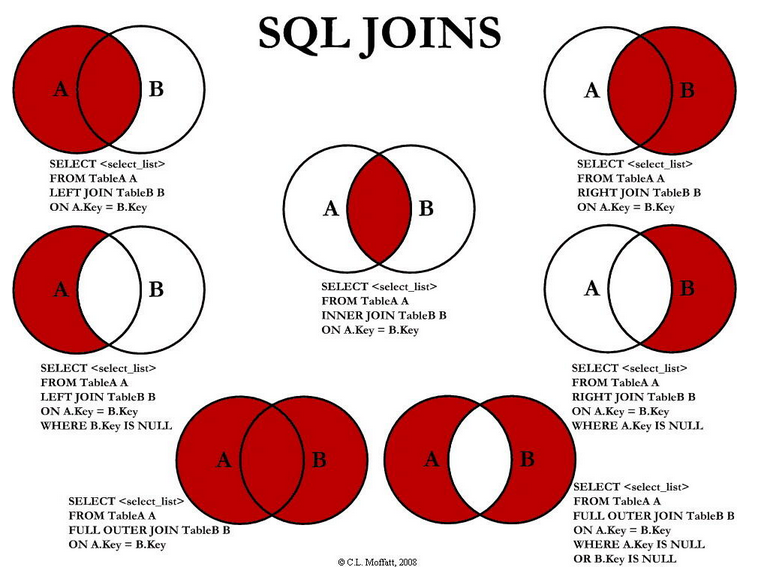

## 38. ORM关系以及一对多：

mysql级别的外键，还不够ORM，必须拿到一个表的外键，然后通过这个外键再去另外一张表中查找，这样太麻烦了。SQLAlchemy提供了一个`relationship`，这个类可以定义属性，以后在访问相关联的表的时候就直接可以通过属性访问的方式就可以访问得到了。示例代码：
```python
class User(Base):
    __tablename__ = 'user'
    id = Column(Integer,primary_key=True,autoincrement=True)
    username = Column(String(50),nullable=False)

    # articles = relationship("Article")

    def __repr__(self):
        return "<User(username:%s)>" % self.username

class Article(Base):
    __tablename__ = 'article'
    id = Column(Integer,primary_key=True,autoincrement=True)
    title = Column(String(50),nullable=False)
    content = Column(Text,nullable=False)
    uid = Column(Integer,ForeignKey("user.id"))

    author = relationship("User", backref='articles')

    def __repr__(self):
        return "<Article(title:%s)>" % self.title
```
找到某个用户的所有文章：

```python
user = session.query(User).filter_by(username='ying').first()
print(user.articles)
```

这里的`user.articles`是一个List的子类，可以使用`append(article)`添加绑定新的文章

**relationship指定的是模型，之前的ForeignKey指定的是表**

另外，可以通过`backref`进行反向引用，上面的例子中，在Article中，`author = relationship("User", backref='articles')`相当于在User中添加了`articles = relationship("Article")`

- 下面的方法也可以将文章与用户绑定在一起

```
user = User(username='ying')
article1.author = user
```


## 39. 一对一的关系：

在sqlalchemy中，如果想要将两个模型映射成一对一的关系，那么应该在父模型中，指定引用的时候，要传递一个`uselist=False`这个参数进去。就是告诉父模型，以后引用这个从模型的时候，不再是一个列表了，而是一个对象了。示例代码如下：

`user.extend`是一个List的继承类，所以使用`uselist=False`

使用`sqlalchemy.orm.backref`来定义`relationship`的反向引用：

```python
class User(Base):
    __tablename__ = 'user'
    id = Column(Integer,primary_key=True,autoincrement=True)
    username = Column(String(50),nullable=False)

    # extend = relationship("UserExtend",uselist=False)

    def __repr__(self):
        return "<User(username:%s)>" % self.username

# 存放一些用户不常用的字段
class UserExtend(Base):
    __tablename__ = 'user_extend'
    id = Column(Integer, primary_key=True, autoincrement=True)
    school = Column(String(50))
    uid = Column(Integer,ForeignKey("user.id", ondelete='CASCADE'))

    user = relationship("User",backref=backref("extend",uselist=False))
```


## 40. 多对多的关系：

1. 多对多的关系需要通过一张中间表来绑定他们之间的关系。

2. 先把两个需要做多对多的模型定义出来

3. 使用Table定义一个中间表，中间表一般就是包含两个模型的外键字段就可以了，并且让他们两个来作为一个“复合主键”。

4. 在两个需要做多对多的模型中随便选择一个模型，定义一个relationship属性，来绑定三者之间的关系，在使用relationship的时候，需要传入一个secondary=中间表。

   多对多相当于是两个多对一，其中的一是中间表

```python
# 定义中间表
article_tag = Table(
    "article_tag",  # 表名
    Base.metadata,
    Column("article_id", Integer, ForeignKey("article.id"), primary_key=True),
    Column("tag_id", Integer, ForeignKey("tag.id"), primary_key=True)
)

class Article(Base):
    __tablename__ = 'article'
    id = Column(Integer, autoincrement=True, primary_key=True)
    title = Column(String(50), nullable=False)

    tag = relationship("Tag", backref="articles", secondary=article_tag)

class Tag(Base):
    __tablename__ = 'tag'
    id = Column(Integer, autoincrement=True, primary_key=True)
    name = Column(String(50), nullable=False)
```

**注意：**

-  中间表需要继承`sqlalchemy.Table`
-  在使用绑定三张表的时候，要记得加上`secondary`参数，填写中间表的名称


## 41. ORM层面删除数据注意事项 

ORM代码删除数据时会无视数据表之间的约束，直接删除数据。然后将外键的数据设置为NULL。就像约束`SET NULL`一样。但是，如果数据项被设置为`nullable=False`的时候，删除会报错。

ORM层面删除数据，会无视mysql级别的外键约束。直接会将对应的数据删除，然后将从表中的那个外键设置为NULL。如果想要避免这种行为，应该将从表中的外键的`nullable=False`。


## 42. `relationship`中的`cascade`参数

在SQLAlchemy，只要将一个数据添加到session中，和他相关联的数据都可以一起存入到数据库中了。这些是怎么设置的呢？其实是通过relationship的时候，有一个关键字参数cascade可以设置这些属性： 

1. save-update：默认选项。在添加一条数据的时候，会把其他和他相关联的数据都添加到数据库中。这种行为就是save-update属性影响的。 
2. delete：表示当删除某一个模型中的数据的时候，是否也删掉使用relationship和他关联的数据。**父删子删**
3. delete-orphan：表示当对一个ORM对象解除了父表中的关联对象的时候，自己便会被删除掉。当然如果父表中的数据被删除，自己也会被删除。**这个选项只能用在一对多上，不能用在多对多以及多对一上。**并且还需要在子模型中的relationship中，增加一个single_parent=True的参数。 
4. merge：默认选项。当在使用session.merge，合并一个对象的时候，会将使用了relationship相关联的对象也进行merge操作。 
5. expunge：移除操作的时候，会将相关联的对象也进行移除。这个操作只是从session中移除，并不会真正的从数据库中删除。 
6. all：是对save-update, merge, refresh-expire, expunge, delete几种的缩写。

```python
class User(Base):
    __tablename__ = 'user'
    id = Column(Integer,primary_key=True,autoincrement=True)
    username = Column(String(50),nullable=False)

    # articles = relationship("Article")

    def __repr__(self):
        return "<User(username:%s)>" % self.username

class Article(Base):
    __tablename__ = 'article'
    id = Column(Integer,primary_key=True,autoincrement=True)
    title = Column(String(50),nullable=False)
    content = Column(Text,nullable=False)
    uid = Column(Integer,ForeignKey("user.id"))

    author = relationship("User", backref='articles', cascade='')

    def __repr__(self):
        return "<Article(title:%s)>" % self.title

user = User(username='ying')
article1 = Article(title='123', content='xxx')
article1.author = user
session.add(article1)
session.commit()
```

这里Article的author中`relationship`的参数`cascade`设置为空字符串，下面添加数据的时候，只添加article是不会通过添加user的。程序运行的时候也会提出警告。`cascade`默认是同时添加。

当`cascade`有多个参数的时候，使用英文逗号分隔，如:`cascade='save-update, delete'`


## 43. 三种排序

1. order_by：可以指定根据这个表中的某个字段进行排序，如果在前面加了一个-，代表的是降序排序。


```python
books = session.query(Book).order_by(Book.price.desc()).all()
或者
books = session.query(Book).order_by(-Book.price).all()
或者
books = session.query(Book).order_by("-price").all()
```
2. 在模型定义的时候指定默认排序：有些时候，不想每次在查询的时候都指定排序的方式，可以在定义模型的时候就指定排序的方式。有以下两种方式：
    * relationship的order_by参数：在指定relationship的时候，传递order_by参数来指定排序的字段。
    * 在模型定义中，添加以下代码：

    ```
    __mapper_args__ = {
            "order_by" : price.desc()
    }
    ```

    即可让文章使用标题来进行排序。
```python
class Book(Base):
    __tablename__ = 'book'

    id = Column(Integer, primary_key=True, autoincrement=True)
    title = Column(String(100), nullable=False)
    price = Column(Float, nullable=False)

    __mapper_args__ = {
        "order_by" : price.desc()
    }

    def __repr__(self):
        return "%s" % self.title

books = session.query(Book).all()
print(books)
```

3. 正序排序与倒序排序：默认是使用正序排序。如果需要使用倒序排序，那么可以使用这个字段的`desc()`方法，或者是在排序的时候使用这个字段的字符串名字，然后在前面加一个负号。


## 44. limit、offset及切片(slice)操作

1. limit：可以限制每次查询的时候只查询几条数据。

```python
books = session.query(Book).limit(5).all()
结果：[title0, title1, title2, title3, title4]
```

2. offset：可以限制查找数据的时候过滤掉前面多少条。

```python
books = session.query(Book).offset(5).limit(3).all()
结果：[title5, title6, title7]
```

3. 切片：可以对Query对象使用切片操作，来获取想要的数据。可以使用`slice(start,stop)`方法来做切片操作。也可以使用`[start:stop]`的方式来进行切片操作。一般在实际开发中，中括号的形式是用得比较多的。希望大家一定要掌握。示例代码如下：

```python
books = session.query(Book).all()[5:9]
结果：[title5, title6, title7, title8]
```
实例： 分页， 数据分3页

```python
books = session.query(Book)#.all()
pages = 3
every_page = 3
for i in range(pages):
    print(books[every_page*i : every_page*(i + 1)])
```

这里可以不用加`.all()`，使用切片会自动把结果转换成list。**仅限切片可以不用加.all()**


## 45. 数据库的懒加载技术

在一对多，或者多对多的时候，如果想要获取多的这一部分的数据的时候，往往能通过一个属性就可以全部获取了。比如有一个作者，想要或者这个作者的所有文章，那么可以通过user.articles就可以获取所有的。但有时候我们不想获取所有的数据，比如只想**获取这个作者今天发表的文章**，那么这时候我们可以给relationship传递一个**lazy='dynamic'**，以后通过user.articles获取到的就不是一个列表，而是一个AppenderQuery对象了。这样就可以对这个对象再进行一层过滤和排序等操作。
通过`lazy='dynamic'`，获取出来的多的那一部分的数据，就是一个`AppenderQuery`对象了。这种对象既可以添加新数据，也可以跟`Query`一样，可以再进行一层过滤。
**总而言之一句话：如果你在获取数据的时候，想要对数据再进行一层过滤时，可以考虑使用`lazy='dynamic'`。**
lazy可用的选项：

1. `select`：这个是默认选项。还是拿`user.articles`的例子来讲。如果你没有访问`user.articles`这个属性，那么sqlalchemy就不会从数据库中查找文章。一旦你访问了这个属性，那么sqlalchemy就会立马从数据库中查找所有的文章，并把查找出来的数据组装成一个列表返回。这也是懒加载。
2. `dynamic`：这个就是我们刚刚讲的。就是在访问`user.articles`的时候返回回来的不是一个列表，而是`AppenderQuery`对象。

使用`dynamic`后，使用`relationship`返回的对象就是一个query的结果对象，然后就可以使用filter进行数据过滤。

```python
class User(Base):
    __tablename__ = 'user'
    id = Column(Integer, primary_key=True, autoincrement=True)
    username = Column(String(50),nullable=False)


class Article(Base):
    __tablename__ = 'article'
    id = Column(Integer, primary_key=True, autoincrement=True)
    title = Column(String(50), nullable=False)
    create_time = Column(DateTime,nullable=False,default=datetime.now)
    uid = Column(Integer,ForeignKey("user.id"))

    author = relationship("User",backref=backref("articles",lazy="dynamic"))

    def __repr__(self):
        return "<Article(title: %s)>" % self.title
```

```python
user = session.query(User).first()
user.books.append(Book(title='title100', price=random.randint(50, 100)))
session.commit()
print(user.books.filter(Book.price>86).all())
```

此时也可以使用append进行添加对象操作


## 46. 高级查询

### group_by

根据某个字段进行分组。比如想要根据性别进行分组，来统计每个分组分别有多少人，那么可以使用以下代码来完成：

```python
session.query(User.gender,func.count(User.id)).group_by(User.gender).all()
```
```python
class GenderEnum(enum.Enum):
    male = "male"
    female = "female"

    def __repr__(self):
        return "%s" % self.value


class Person(Base):
    __tablename__ = 'person'
    id = Column(Integer, primary_key=True, autoincrement=True)
    name = Column(String(50), nullable=False)
    gender = Column(Enum(GenderEnum))
    age = Column(Integer, nullable=False)

    def __repr__(self):
        return '%s' % self.name


Base.metadata.drop_all()
Base.metadata.create_all()

for i in range(20):
    p = Person(name="小%s" % i, gender=random.choice([name for name, member in GenderEnum.__members__.items()]), age=random.randint(1, 30))
    session.add(p)

session.commit()
```

```python
peoples = session.query(Person.gender, func.count(Person.id)).group_by(Person.gender).all()
```


### having

having是对查找结果进一步过滤。对分组进行having过滤。示例代码如下：

```python
peoples = session.query(Person.gender, func.count(Person.id)).group_by(Person.gender).having(Person.gender=='male').all()
```


### join



1. join分为left join（左外连接）和right join（右外连接）以及内连接（等值连接）。
2. 参考的网页：http://www.jb51.net/article/15386.htm
3. 在sqlalchemy中，使用join来完成内连接。在写join的时候，如果不写join的条件，那么默认将使用外键来作为条件连接。
4. query查找出来什么值，不会取决于join后面的东西，而是取决于query方法中传了什么参数。就跟原生sql中的select 后面那一个一样。
  比如现在要实现一个功能，要查找所有用户，按照发表文章的数量来进行排序。示例代码如下：
```python
result = session.query(User,func.count(Article.id)).join(Article).group_by(User.id).order_by(func.count(Article.id).desc()).all()
```


### subquery：
子查询可以让多个查询变成一个查询，只要查找一次数据库，性能相对来讲更加高效一点。不用写多个sql语句就可以实现一些复杂的查询。那么在sqlalchemy中，要实现一个子查询，应该使用以下几个步骤：
1. 将子查询按照传统的方式写好查询代码，然后在`query`对象后面执行`subquery`方法，将这个查询变成一个子查询。
2. 在子查询中，将以后需要用到的字段通过`label`方法，取个别名。
3. 在父查询中，如果想要使用子查询的字段，那么可以通过子查询的返回值上的`c`属性拿到。
  整体的示例代码如下：
```python
stmt = session.query(User.city.label("city"),User.age.label("age")).filter(User.username=='李A').subquery()
result = session.query(User).filter(User.city==stmt.c.city,User.age==stmt.c.age).all()
```
**`stmt.c.city`这里的c是Column的简写**

- 注： SQL练习题：https://blog.csdn.net/laoduan_78/article/details/44259245			和当前目录下的`SQL练习`


## 47. Flask-SQLAlchemy 

### 安装：
```shell
pip install flask-sqlalchemy
```

### 数据库连接：
1. 跟sqlalchemy一样，定义好数据库连接字符串DB_URI。
2. 将这个定义好的数据库连接字符串DB_URI，通过`SQLALCHEMY_DATABASE_URI`这个键放到`app.config`中。示例代码：`app.config["SQLALCHEMY_DATABASE_URI"] = DB_URI`.
3. 使用`flask_sqlalchemy.SQLAlchemy`这个类定义一个对象，并将`app`传入进去。示例代码：`db = SQLAlchemy(app)`。

### 创建ORM模型：
1. 还是跟使用sqlalchemy一样，定义模型。现在不再是需要使用`delarative_base`来创建一个基类。而是使用`db.Model`来作为基类。
2. 在模型类中，`Column`、`String`、`Integer`以及`relationship`等，都不需要导入了，直接使用`db`下面相应的属性名就可以了。
3. 在定义模型的时候，可以不写`__tablename__`，那么`flask_sqlalchemy`会默认使用当前的模型的名字转换成小写来作为表的名字，并且如果这个模型的名字使用了多个单词并且使用了驼峰命名法，那么会在多个单词之间使用下划线来进行连接。**虽然flask_sqlalchemy给我们提供了这个特性，但是不推荐使用。**

### 将ORM模型映射到数据库：
1. db.drop_all()
2. db.create_all()

### 使用session：
以后session也不需要使用`sessionmaker`来创建了。直接使用`db.session`就可以了。操作这个session的时候就跟之前的`sqlalchemy`的`session`是iyimoyiyang的。

### 查询数据：
如果查找数据只是查找一个模型上的数据，那么可以通过`模型.query`的方式进行查找。`query`就跟之前的sqlalchemy中的query方法是一样用的。示例代码如下：
```python
users = User.query.order_by(User.id.desc()).all()
print(users)
```


## 48. alembic数据库迁移工具

`alembic`是由`SQLAlchemy`的作者(Michael Bayer)开发。用来做ORM模型与数据库的迁移与映射。`alembic`的方式类似git，表现在：

1. `alembic`所有的命令都以`alembic`开头；
2. `alembic`的迁移文件也是通过版本进行控制的

### 安装

```shell
pip install alembic
```

使用alembic的步骤：

1. 定义好自己的模型。


```python
class User(Base):
    __tablename__ = 'user'

    id = Column(Integer, primary_key=True, autoincrement=True)
    username = Column(String(50), nullable=False)

    def __repr__(self):
        return "%s" % self.username
```

2. 使用alembic创建一个仓库：`alembic init [仓库的名字，推荐使用alembic]`。

3. 修改配置文件：
    * 在`alembic.ini`中，给`sqlalchemy.url`设置数据库的连接方式。这个连接方式跟sqlalchemy的方式一样的。
    * 在`alembic/env.py`中的`target_metadata`设置模型的`Base.metadata`。但是要导入`models`，需要将models所在的路径添加到这个文件中。示例代码如下：
        ```python
        import sys,os
        sys.path.append(os.path.dirname(os.path.dirname(__file__)))
        from alembic_demo import Base
        target_metadata = Base.metadata
        ```

    `os.path.dirname(__file__)`可以获取当前文件的目录

4. **将ORM模型生成迁移脚本：`alembic revision --autogenerate -m 'message'`。**

5. **将生成的脚本映射到数据库中：`alembic upgrade head`。**

6. 以后如果修改了模型，重复4、5步骤。

7. 注意事项：在终端中，如果想要使用alembic，则需要首先进入到安装了alembic的虚拟环境中，不然就找不到这个命令。

### 常用命令：
1. init：创建一个alembic仓库。
2. revision：创建一个新的版本文件。
3. --autogenerate：自动将当前模型的修改，生成迁移脚本。
4. -m：本次迁移做了哪些修改，用户可以指定这个参数，方便回顾。
5. upgrade：将指定版本的迁移文件映射到数据库中，会执行版本文件中的upgrade函数。如果有多个迁移脚本没有被映射到数据库中，那么会执行多个迁移脚本。
6. [head]：代表最新的迁移脚本的版本号。
7. downgrade：会执行指定版本的迁移文件中的downgrade函数。
8. heads：展示head指向的脚本文件版本号。
9. history：列出所有的迁移版本及其信息。
10. current：展示当前数据库中的版本号。

### 经典错误：
1. FAILED: Target database is not up to date.
    * 原因：主要是heads和current不相同。current落后于heads的版本。
    * 解决办法：将current移动到head上。`alembic upgrade head`
2. FAILED: Can't locate revision identified by '77525ee61b5b'
    * 原因：数据库中存的版本号不在迁移脚本文件中
    * 解决办法：删除数据库的alembic_version表中的数据，重新执行alembic upgrade head
3. 执行`upgrade head`时报某个表已经存在的错误：
    * 原因：执行这个命令的时候，会执行所有的迁移脚本，因为数据库中已经存在了这个表。然后迁移脚本中又包含了创建表的代码。
    * 解决办法：（1）删除versions中所有的迁移文件。（2）修改迁移脚本中创建表的代码。(先把upgrade方法内容改成pass，然后再改回来)


## 49. flask-sqlalchemy中配置alembic

创建flask项目，创建好模型

```
alembic init alembic
修改配置文件
        import sys, os
        sys.path.append(os.path.dirname(os.path.dirname(__file__)))
		from app import db
		target_metadata = db.Model.metadata
这里和之前不同， 这里还要注意加入路径和导入db的顺序

alembic revision --autogenerate -m "first commit"
alembic upgrade head
```

