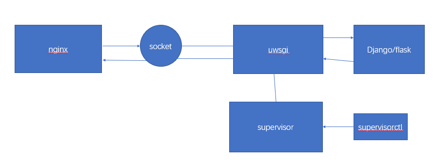

## 76. 部署

### 在开发机上做准备

1. 确保项目没有BUG

2. 用`pip freeze > requirements.txt`将当前环境所需要的包写入到`requirements.txt`中

3. 将项目上传到服务器的`/srv`目录下。这里以`git`为例

   ```
   git init
   git remote add origin xxx.git
   git pull origin master --allow-unrelated-histories
   git add .
   git commit -m "xxx"
   git push origin master
   ```


### 在服务器上的准备工作

1. 安装`MySQL`服务器和客户端

   ```shell
   yum install mysql-server mysql-client
   yum install libmysqld-dev
   ```

2. 安装好项目用到的Python版本

   ```
   yum install python
   yum install python-pip
   pip install --upgrade pip
   ```

3. 安装`virtualenv`以及`virutalenvwrapper`。并创建虚拟环境。

   - pip install virtualenv
   - pip install virtualenvwrapper
   - yum install vim
   - vim ~/.bashrc 进入文件中，填入以下两行代码：
     `python export WORKON_HOME=$HOME/.virtualenvs source /usr/local/bin/virtualenvwrapper.sh`
   - source ~/.bashrc

4. 安装`git`：

   1. `yum install git`
   2. 为了方便XShell或者CRT连接服务器，建议安装`OpenSSH`：
      `yum install openssh-server openssh-client service ssh restart`
   3. 安装`MySQL`服务器和客户端：
      `yum install mysql-server mysql-client sudo apt-get install libmysqld-dev`
   4. 进入虚拟环境中，然后进入到项目所在目录，执行命令：`pip install -r requirements.txt`，安装好相应的包。
   5. 在`mysql`数据库中，创建相应的数据库。
   6. 执行`python manage.py migrate`命令，将迁移文件，映射到数据库中，创建相应的表。
   7. 执行`python manage.py runserver 0.0.0.0:8000`，然后在你自己电脑上，在浏览器中输入`http://你的服务器的ip地址:8000/`，访问下网站所有页 面，确保所有页面都没有错误。
   8. 设置`ALLOW_HOST`为你的域名，以及ip地址。
   9. 设置`DEBUG=False`，避免如果你的网站产生错误，而将错误信息暴漏给用户。
   10. 收集静态文件：`python manage.py collectstatic`。

   ### 安装uwsgi

   1. uwsgi是一个应用服务器，非静态文件的网络请求就必须通过他完成，他也可以充当静态文件服务器，但不是他的强项。uwsgi是使用python编写的，因此通过`pip install uwsgi`就可以了。(uwsgi必须安装在系统级别的Python环境中，不要安装到虚拟环境中)。
   2. 使用命令`uwsgi --http :8000 --module yingjoy.wsgi --vritualenv=/root/.virtualenvs/django-env-py2`。用`uwsgi`启动项目，如果能够在浏览器中访问到这个页面，说明`uwsgi`可以加载项目了。

   ### 编写uwsgi配置文件：

   在项目的路径下面，创建一个文件叫做`yingjoy_uwsgi.ini`的文件，然后填写以下代码：

   ```
   [uwsgi]

   # Django相关的配置
   # 必须全部为绝对路径
   # 项目的路径
   chdir           = /srv/yingjoy
   # Django的wsgi文件
   module          = yingjoy.wsgi
   # Python虚拟环境的路径
   home            = /root/.virtualenvs/django-env-py2

   # 进程相关的设置
   # 主进程
   master          = true
   # 最大数量的工作进程
   processes       = 10
   # socket文件路径，绝对路径
   socket          = /srv/yingjoy/yingjoy.sock
   # 设置socket的权限
   chmod-socket    = 666
   # 退出的时候是否清理环境
   vacuum          = true
   ```

   然后使用命令`uwsgi --ini yingjoy.ini`，看下是否还能启动这个项目。

   ### 安装nginx：

   1. nginx是一个web服务器。用来加载静态文件和接收http请求的。通过命令`sudo apt install nginx`即可安装。

   2. ```
      nginx
      ```

      常用命令：

      - 启动nginx：service nginx start
      - 关闭nginx：service nginx stop
      - 重启nginx：service nginx restart

   ### 收集静态文件：

   静态文件应该让nginx来服务，而不是让django来做。首先确保你的`settings.py`文件中有一个`STATIC_ROOT`配置，这个配置应该指定你的静态文件要放在哪个目录下。那么我们可以执行以下命令：`python manage.py collectstatic`来收集所有静态文件，将这些静态文件放在指定的目录下。

   ### 编写nginx配置文件：

   在`/etc/nginx/conf.d`目录下，新建一个文件，叫做`yingjoy.conf`，然后将以下代码粘贴进去：

   ```
   upstream yingjoy {
       server unix:///srv/yingjoy/yingjoy.sock; 
   }

   # 配置服务器
   server {
       # 监听的端口号
       listen      80;
       # 域名
       server_name 192.168.0.101; 
       charset     utf-8;

       # 最大的文件上传尺寸
       client_max_body_size 75M;  

       # 静态文件访问的url
       location /static {
           # 静态文件地址
           alias /srv/yingjoy/static_dist; 
       }

       # 最后，发送所有非静态文件请求到django服务器
       location / {
           uwsgi_pass  yingjoy;
           # uwsgi_params文件地址
           include     /etc/nginx/uwsgi_params; 
       }
   }
   ```

   写完配置文件后，为了测试配置文件是否设置成功，运行命令：`service nginx configtest`，如果不报错，说明成功。
   每次修改完了配置文件，都要记得运行`service nginx restart`。

   ### 使用supervisor配置：

   让supervisor管理uwsgi，可以在uwsgi发生意外的情况下，会自动的重启。

   1. `supervisor`的安装：在系统级别的python环境下`pip install supervisor`。

   2. [supervisord]
      \# log的级别
      loglevel=info

      \# 使用supervisorctl的配置
      [supervisorctl]
      \# 使用supervisorctl登录的地址和端口号
      serverurl = [http://127.0.0.1:9001](http://127.0.0.1:9001/)

      \# 登录supervisorctl的用户名和密码
      username = admin
      password = 123

      [inet_http_server]
      \# supervisor的服务器
      port = :9001
      \# 用户名和密码
      username = admin
      password = 123

      [rpcinterface:supervisor]
      ​

      supervisor.rpcinterface_factory = supervisor.rpcinterface:make_main_rpcinterface

      然后使用命令
      ```
      supervisord -c ying_supervisor.conf
      ```
      运行就可以了。 以后如果想要启动uwsgi，就可以通过命令
      ```
      supervisorctl -c supervisor.conf`进入到管理控制台，然后可以执行相关的命令进行管理：

      - status # 查看状态
      - start program_name #启动程序
      - restart program_name #重新启动程序
      - stop program_name # 关闭程序
      - reload # 重新加载配置文件
      - quit # 退出控制台
      ```

   ### nginx+uwsgi+supervisor关系图

   

   ​